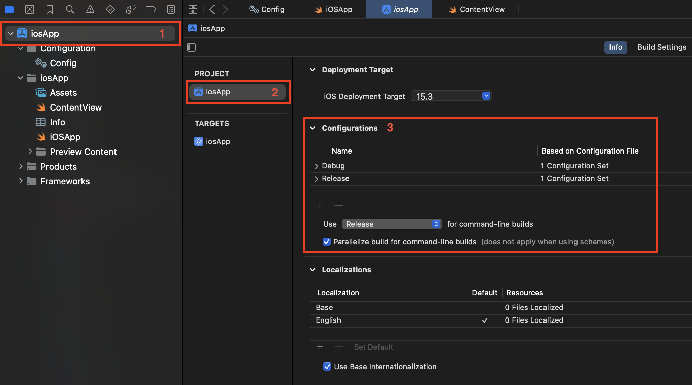
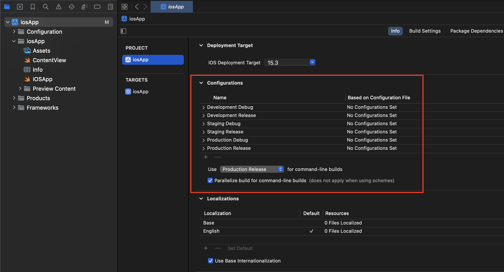
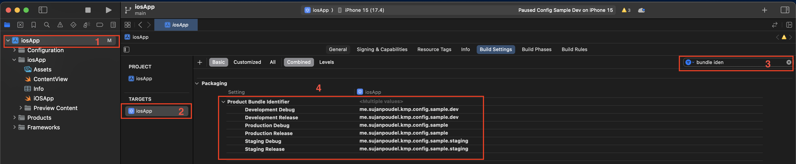
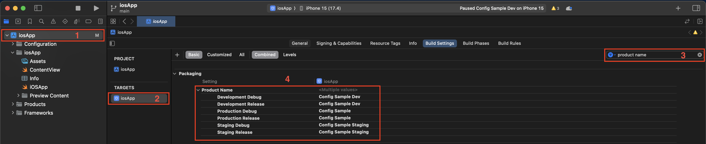
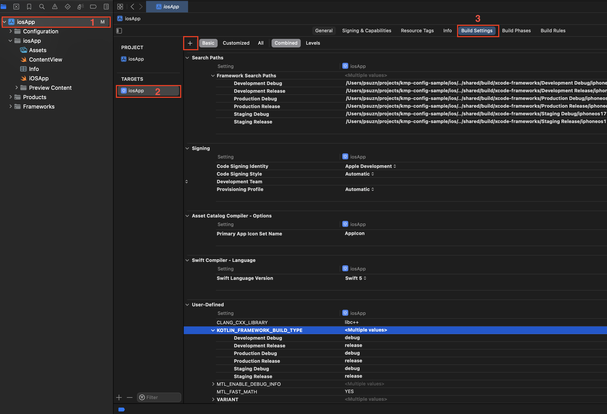
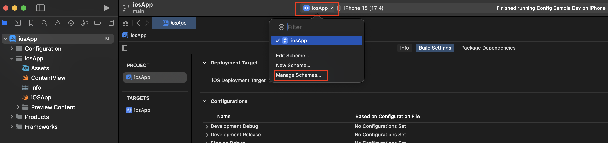
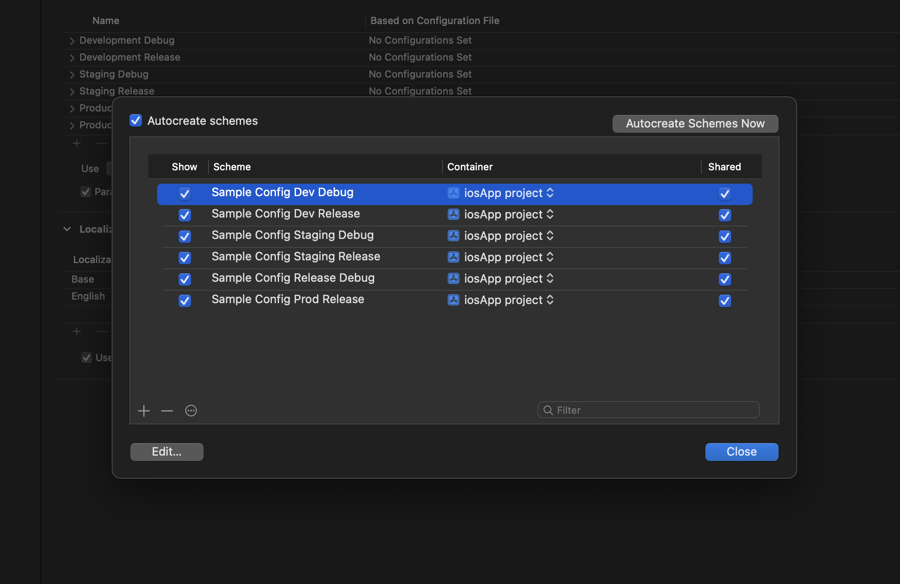
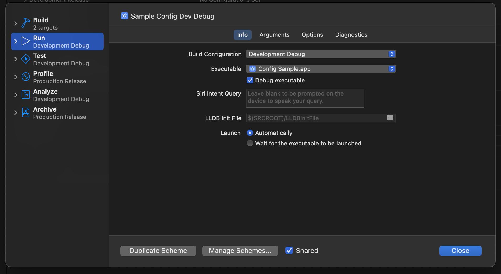
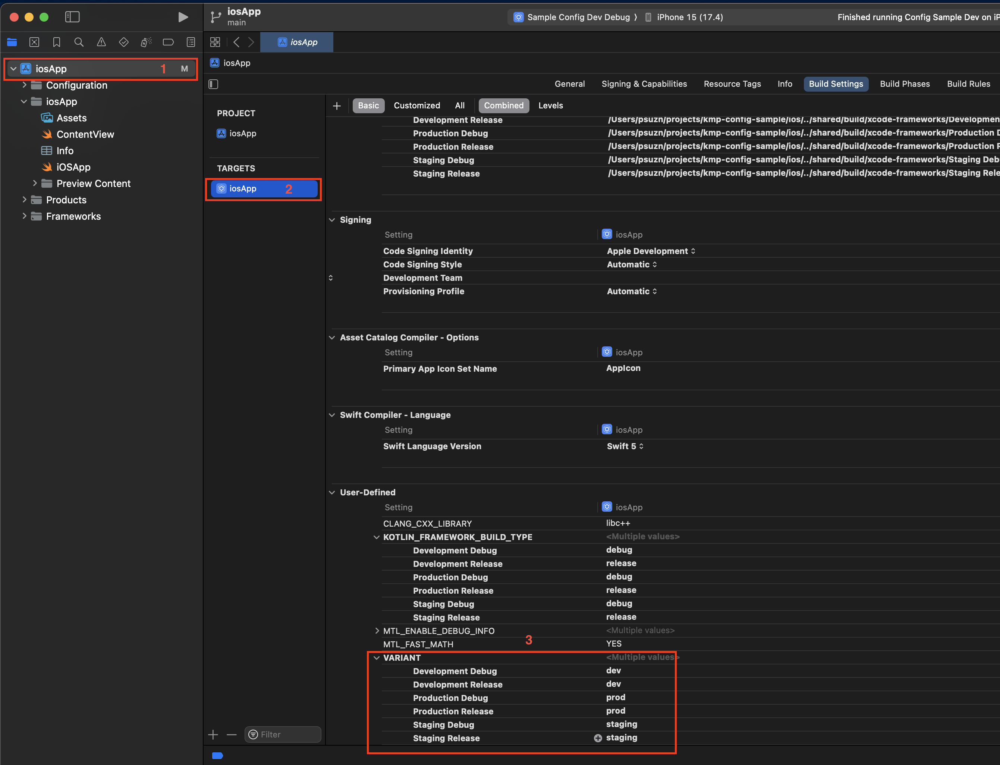
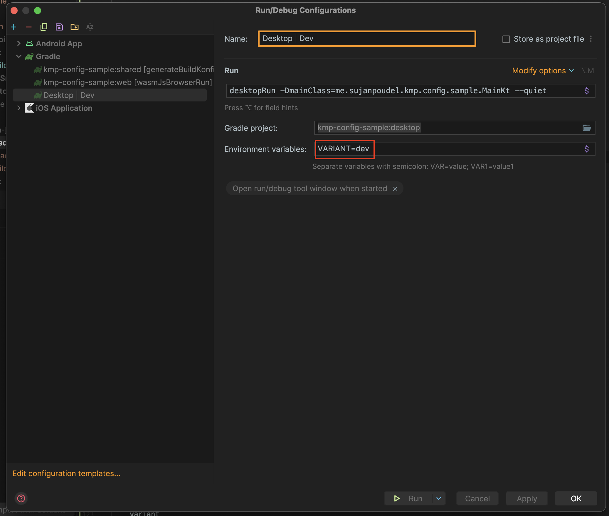

When we are working on mobile/web app, it is common to have different configurations like different API endpoints, different logging setups and other things for different environments like staging, QA, and production. In Android, we manage those configurations with the product flavors by providing different Build Config field values for different flavors.

But when working with Kotlin multiplatform there is not a straightforward way to do the same but with some little configuration and using the [BuildKonfig](https://github.com/yshrsmz/BuildKonfig) library by [yshrsmz](https://github.com/yshrsmz) we can achieve a similar setup.

## Project Layout

```
/
..
├── android
│    └── build.gradle.kts
├── ios
│    ├── ios/iosApp.xcodeproj
│    ..
├── shared
│    └── build.gradle.kts
└── gradle
     └── libs.versions.toml
```

## Steps

1. Apply [buildkonfig](https://github.com/yshrsmz/BuildKonfig) plugin.

   ```toml
   ## gradle/libs.versions.toml

   [versions]
   buildkonfig = "0.15.1"

   [plugins]
   buildkonfig = { id = "com.codingfeline.buildkonfig", version.ref = "buildkonfig" }

   ```

   ```kt
   // build.gradle.kts

   plugins{
     ...
     alias(libs.plugins.buildkonfig) apply false
   }

   ```

   ```kt
   // shared/build.gradle.kts

   plugins{
     alias(libs.plugins.buildkonfig)
   }

   ```

2. Create Android build flavors

   > Here we are creating 3 flavors (i.e. dev, staging & prod) with variant dimensions

   ```kt
   // android/build.gradle.kts

   android {
     ...

     flavorDimensions.add("variant")

     productFlavors {
       create("dev") {
         dimension = "variant"
         isDefault = true
         applicationIdSuffix = ".dev"
         resValue("string", "app_name", "Config Sample Dev")
       }

       create("staging") {
         dimension = "variant"
         applicationIdSuffix = ".staging"
         resValue("string", "app_name", "Config Sample Staging")
       }

       create("prod") {
         dimension = "variant"
       }
     }
   }

   ```

3. Setup the flavors and schema for IOS

   - Open your IOS project in Xcode, select your **Project** and **Info** tab and remove existing configurations (they are Debug and Release).
     
     <center>Fig. Existing configurations</center>
   - Add new configurations, two for each flavour. One for the debug and another for the release build.
     
      <center>Fig. New configurations</center>
   - Change the bundle identifier for each configuration
     
      <center>Fig. New bundle identifiers</center>
   - Change the Product name for each configuration
     
       <center>Fig. New product names</center>
   - Since we have changed the default configurations, Kotlin doesn't know whether to build the binary for release or debug configurations. We have to add `KOTLIN_FRAMEWORK_BUILD_TYPE` corresponding to the configuration as user settings.
     
     <center>Fig. exposing KOTLIN_FRAMEWORK_BUILD_TYPE</center>
   - Delete the existing schemas and the new 6 schemas that correspond to the 6 configurations.
     
     
      <center>Fig. New schemas</center>

     Now open each of the schemas and do the following for each:

     - Choose the corresponding configuration
     - Uncheck the **Debug executable** checkbox for release schemas

     | <center> Sample Config Dev Debug </center>                           | <center> Sample Config Dev Release </center>                         |
     | -------------------------------------------------------------------- | -------------------------------------------------------------------- |
     |  |  |

   - Now let's expose the variant to the shared KMP module so we can generate different build config depending on the variants.
     Add a **"VARIANT"** user defined setting
     
      <center> Fig. Exposing the variant as user defined settings </center>

4. **Buildkonfig** setup with the variants.
   Now let's go back to the shared module's build.gradle.kts and do the rest of the Buildkonfig setup.

   ```kt
      // shared/build.gradle.kts

     project.extra.set("buildkonfig.flavor", currentBuildVariant())

     buildkonfig {
       packageName = "me.sujanpoudel.kmp.config.sample"
       objectName = "SampleConfig"
       exposeObjectWithName = "SampleConfig"

       defaultConfigs {
         buildConfigField(FieldSpec.Type.STRING, "variant", "dev")
         buildConfigField(FieldSpec.Type.STRING, "apiEndPoint", "https://dev.example.com")
       }

       defaultConfigs("dev") {
         buildConfigField(FieldSpec.Type.STRING, "variant", "dev")
         buildConfigField(FieldSpec.Type.STRING, "apiEndPoint", "https://dev.example.com")
       }

       defaultConfigs("staging") {
         buildConfigField(FieldSpec.Type.STRING, "variant", "staging")
         buildConfigField(FieldSpec.Type.STRING, "apiEndPoint", "https://staging.example.com")
       }

       defaultConfigs("prod") {
         buildConfigField(FieldSpec.Type.STRING, "variant", "prod")
         buildConfigField(FieldSpec.Type.STRING, "apiEndPoint", "https://example.com")
       }
     }
   ```

   A few key things here are:

   - we are setting `buildkonfig.flavor` property at build time.
   - `currentBuildVariant()` determines the current Build Variant, which can be for the android's variant or ios's variant.
   - `dev` is the default variant

   Body for the `currentBuildVariant()`

   ```kotlin
    // shared/build.gradle.kts

    fun Project.getAndroidBuildVariantOrNull(): String? {
      val variants = setOf("dev", "prod", "staging")
      val taskRequestsStr = gradle.startParameter.taskRequests.toString()
      val pattern: Pattern = if (taskRequestsStr.contains("assemble")) {
        Pattern.compile("assemble(\\w+)(Release|Debug)")
      } else {
        Pattern.compile("bundle(\\w+)(Release|Debug)")
      }

      val matcher = pattern.matcher(taskRequestsStr)
      val variant = if (matcher.find()) matcher.group(1).lowercase() else null
      return if (variant in variants) {
        variant
      } else {
        null
      }
    }

    private fun Project.currentBuildVariant(): String {
      val variants = setOf("dev", "prod", "staging")
      return getAndroidBuildVariantOrNull()
        ?: System.getenv()["VARIANT"]
          .toString()
          .takeIf { it in variants } ?: dev
    }

   ```

Now everything is in place and you should be able to choose the build variant from Android Studio or different schemas from Xcode and the correct build config
object should be generated. To change the variant for the other targets like for desktop or for the js you have to set the environment variable.



With a little bit more work we can load the build configs from a property file. You can check the [sample app](https://github.com/psuzn/kmp-config-sample/blob/main/shared/build.gradle.kts) for that.

```kt
buildkonfig {
  packageName = "me.sujanpoudel.kmp.config.sample"
  objectName = "SampleConfig"

  defaultConfigs {
    field("variant", dev)
    configsFromProperties("dev.sample.properties")
  }

  defaultConfigs(dev) {
    field("variant", dev)
    configsFromProperties("dev.sample.properties")
  }

  defaultConfigs(staging) {
    field("variant", staging)
    configsFromProperties("staging.sample.properties")
  }

  defaultConfigs(prod) {
    field("variant", prod)
    configsFromProperties("prod.sample.properties")
  }
}
```

You can find the sample app at [https://github.com/psuzn/kmp-config-sample](https://github.com/psuzn/kmp-config-sample).

If you find any typos or problems on this blog, please create an issue at [https://github.com/psuzn](https://github.com/psuzn).
